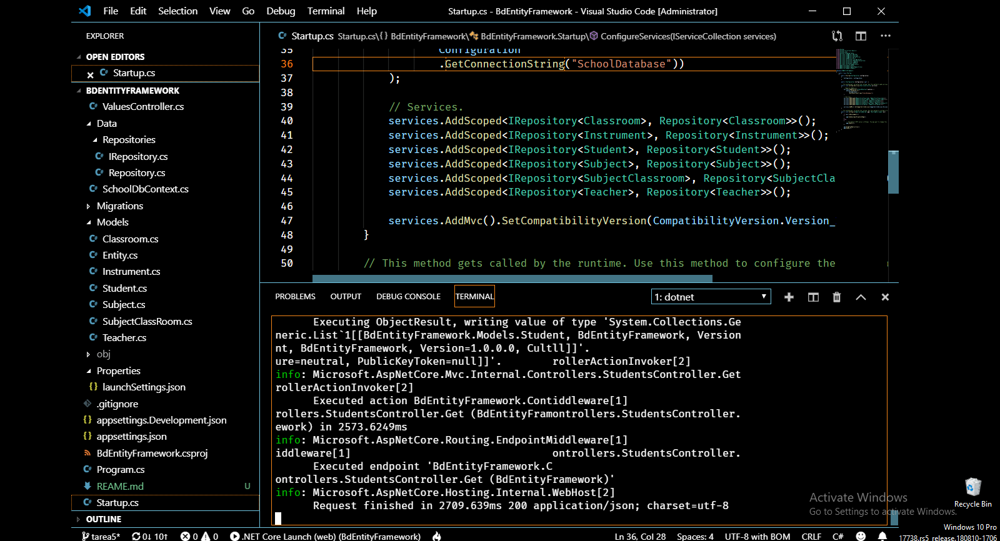
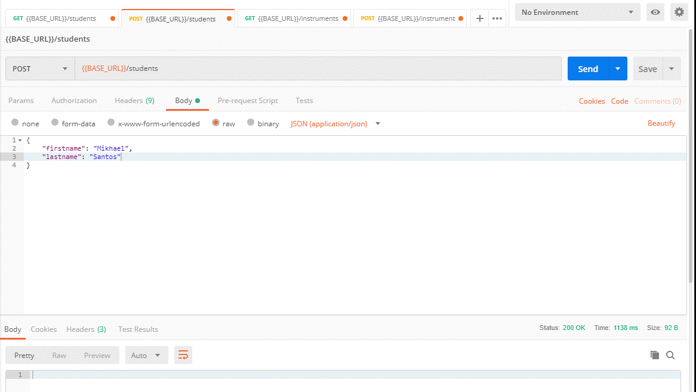
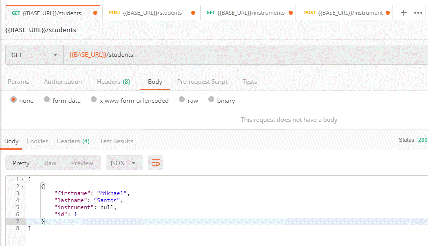
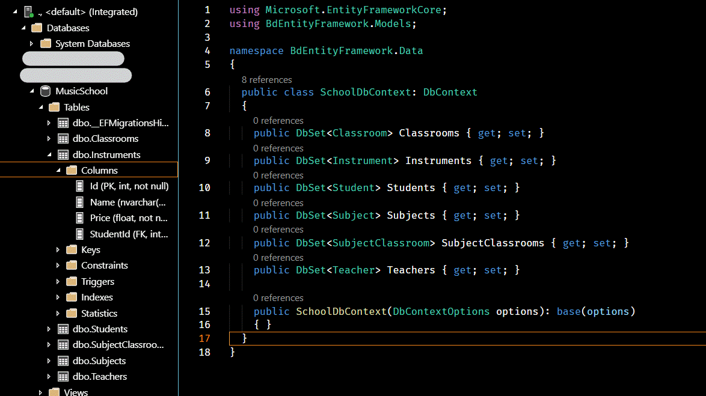

# Entity Framework Core

Este proyecto consiste en hacer un CRUD API de 10 tablas con relaciones entre ellas usando ASP.NET Core. 

A continuación, algunas capturas de pantalla que muestran la estructura del proyecto y la base de datos a grandes razgos:

- **Estructura del proyecto**:

  

- **Probando POST y GET de la tabla Students**:

  
  

- **Estructura de la base de datos**:

  